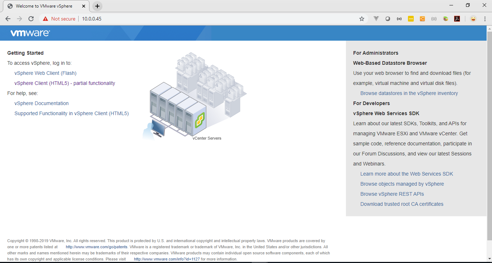

# Getting Started MySQL Lab @ VSTECS #

## Before You Begin ##

### Background ###

### What Do You Need? ###
* username
* password 

## Create an OML User ##
1. Sign in to the [VSTECS VCENTER](https://10.0.0.45/websso/SAML2/SSO/vstecs.local?SAMLRequest=zVRdb5swFH3fr0B%2BBwMhW2KFVFmzapXalZVsmvYyGbhJLBk78zWQ%2FvsZkmxR11V5nHiz7j33fInZ%0A1b6WXgsGhVYpiYKQeKBKXQm1ScmX1Y0%2FIVfzNzPktdyxRWO36hF%2BNoDWWyCCsW7tWitsajA5mFaU%0AcKsq2KfEAS3dmFDcDtBba3fIKI3CoP%2BSMe2gQNQ0X9zfxTTPH2iLFkoMpC65JN6NNiUMF1Oy5hKB%0AeLfLlPwYrfl6PCneTsYhn%2FBoCqNknUBRFO%2BmRTKqYjeGGUcULfxZRGwcMbRc2ZTEYTT1o8iP4lU4%0AZqOIjSdBGCbfiZcZbXWp5XuhDg40RjHNUSBTvAZktmQ9XxYHISsOQ8g%2BrlaZnz3kqwGgFRWYT27a%0A2XnSypJkRLyvJ5vj3mZnvEI2GPv6nd2RFJkfYxjUmMsB%2BCkpMv87hUbQHuKURg2WV9zyGT2%2Fdbgc%0A71iv63aZaSnKJ28hpe6uDXDrtFrTwBBaze3rdPoXUfnrYZTtelNc8MoSL896%2FM8Nl2ItwLxUmn%2FQ%0APbczvtRPepTFXIMr0RuE5zAXm%2Foc5QjSupWDBKegrTtuICh1TbHcQs2RcmuNPwBT18iYhgn9sHdG%0A9B3Bk6A9it8YXdcF3SjQZuMWwoh%2Bu7%2FLByxfDNUuXQBuntmnnQukP88eQUHHCwkr9%2FaC4P%2BI6hIk%0AbM6p0ufhzE%2BlPP8PzX8B&SigAlg=http%3A%2F%2Fwww.w3.org%2F2001%2F04%2Fxmldsig-more%23rsa-sha256&Signature=CRPgGbiottSyxxbO89wy0Bjtu317IQJcJAx9vCGNlE9gw2G1NgWtaOkyckALiYqCnl6B8R35iLUY%0AyLZRjD8AmoCU7XA3LZN7HJNeFkJEvNcFHtyYio8XZPPLMfK3SwIEZfihvYRJ5CX7q2xi8FVyVXfe%0A5wFctBLiolC%2Fp8vp6wCsG1XgqWXwAbuq9XneRTZorrX9NVEKBnrH%2BXkcGXNTygpEPDAIl%2FDKpYDN%0APZfXSwvS0I5oDC1X4Iv%2B%2Bt1Qt3A5ALPc2Js3t07RC1Ud%2BNP71AZ7kt5bT3eRBSJjRAXsvtp%2B%2FFQf%0AxpqIzhnM864DmjnCvnEsK%2Bf3wLlKxlOnnKiSiw%3D%3D).

    
    
    
    
    
    
    
    
    
    
    
    
    

## Want to Learn More? ##
