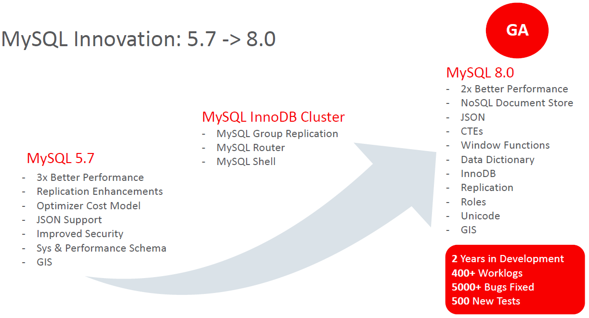
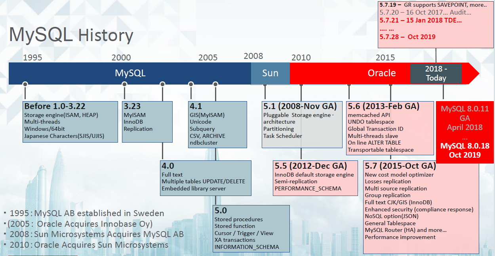

# MySQL Enterprise Edition Lab2
 Introduction MySQL 

 



# Preparation
[Create New Instance](lab1#create-new-mysql-instance)

# MySQLComponents
### Started with mysqld_safe
```
sudo -u mysql /lab/mysql/bin/mysqld_safe --defaults-file=/lab/mysql_home01/my.cfg 2>&1 &>/dev/null &
```
### Connect to mysqlserver 

```
mysql -u root -h 127.0.0.1 -P3310
or 
mysql -u root -S /lab/mysql_home01/mysqld.sock
```
mysql>
```

## Storage Engines
### InnoDB
```
show engines;
show status like '%Innodb%';
show engine innodb status\G
```
### Performance_schema
```
use performance_schema
show tables;
select * from events_statements_summary_by_digest order by COUNT_STAR desc limit 2\G

use sys
show tables;
select * from statement_analysis order by exec_count desc limit 2\G

\! mysqlslap --concurrency=5 --iterations=20 --number-int-cols=2 --number-char-cols=3 --auto-generate-sql

select * from statement_analysis order by exec_count desc limit 2\G
```
mysql>
```
shutdown;
```

### Started with mysqld_safe
```
sudo -u mysql /lab/mysql/bin/mysqld_safe --defaults-file=/lab/mysql_home01/my.cfg 2>&1 &>/dev/null &
```
### Connect to mysqlserver 

```
mysql -u root -h 127.0.0.1 -P3310
```
mysql>
```
show variables like 'general_log';
set global general_log = true;
show variables like 'general_log%';
```
open new terminal 
```
tail -f <PATH files in Value>.log
```

Go to mysql terminal
```
select 1;
restart;
set persist general_log = true;
restart;
```
### Test kill process MySQL Server
```
more /lab/mysql_home01/mysqld.pid
```
See number 3698(Sample)
```
kill -9 3698
more *.pid
```
It Change. Why 

### Shutdown MySQL Server
```
mysql -u root -h 127.0.0.1 -P3310
```
mysql>
```
shutdown;
```

