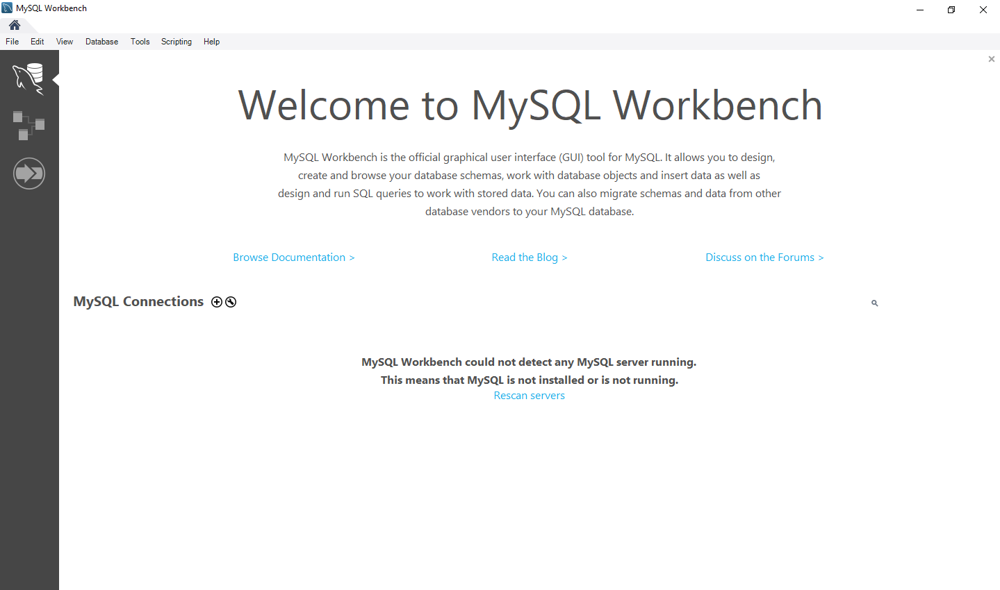
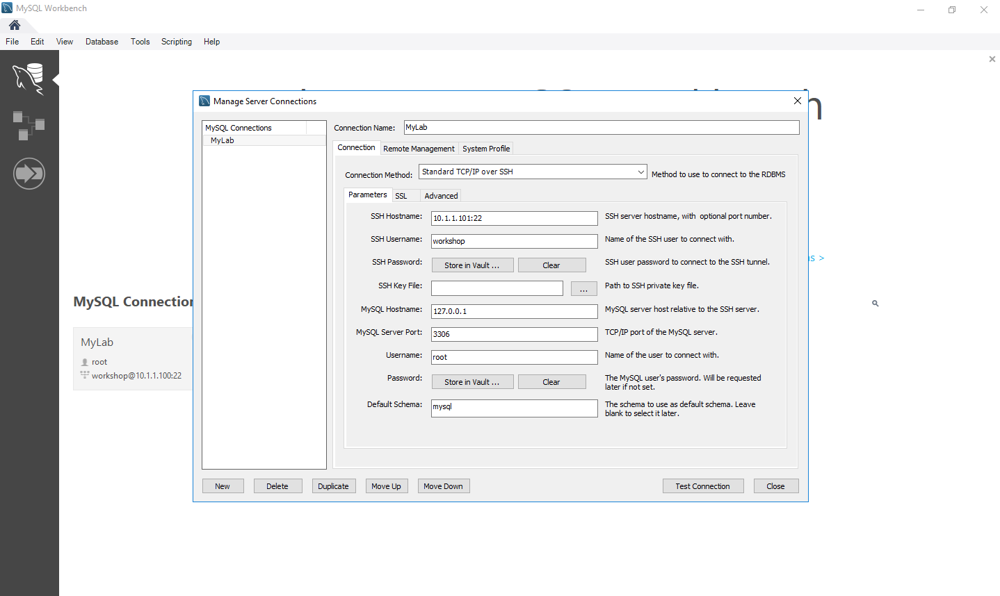
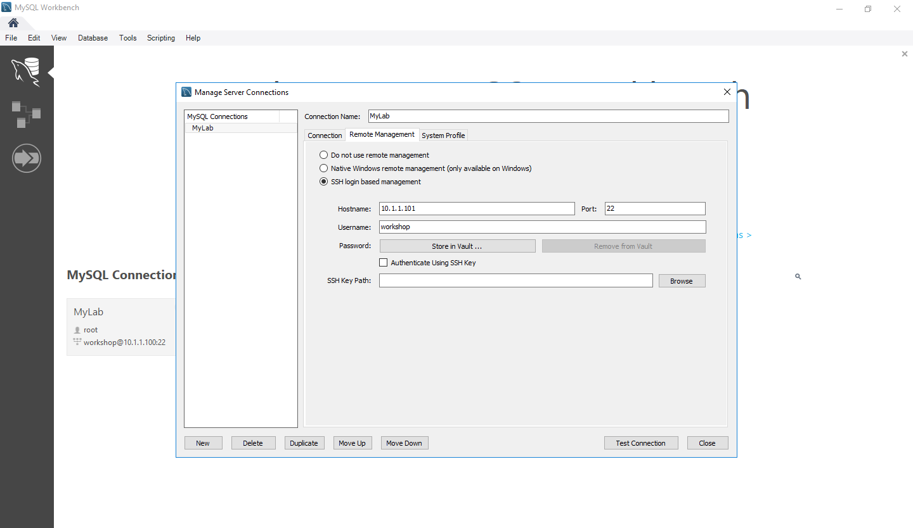
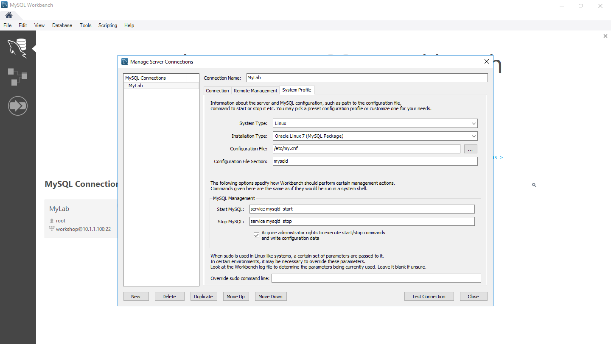
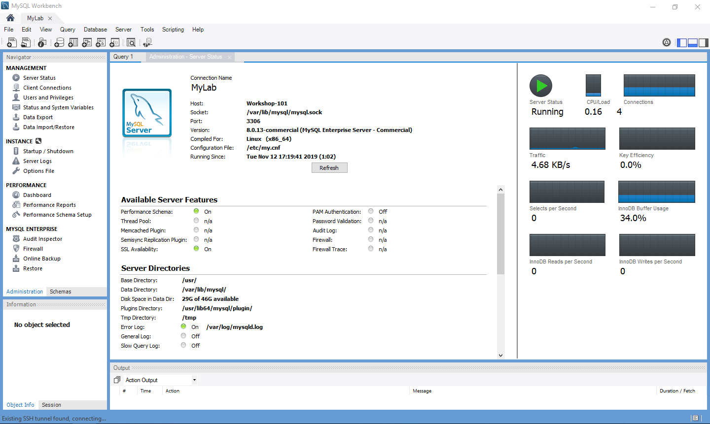

# MySQL Enterprise Edition Lab3
MySQL Workbench

# Preparation
```
adduser workshop
passwd workshop
usermod -aG wheel workshop
visudo
```
Uncomment this line
````
%wheel  ALL=(ALL)       NOPASSWD: ALL
````
## Open MySQL Workbench
 

## Add Connection 


## Edit Connection 



## Work
